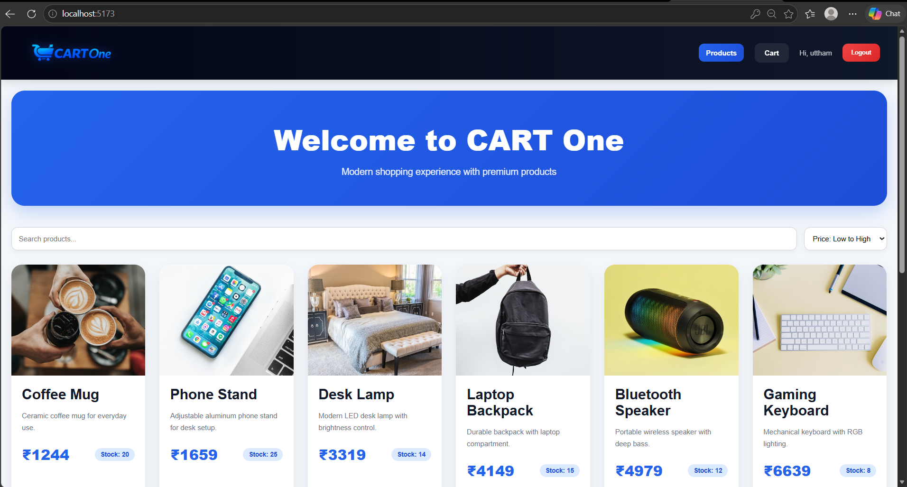
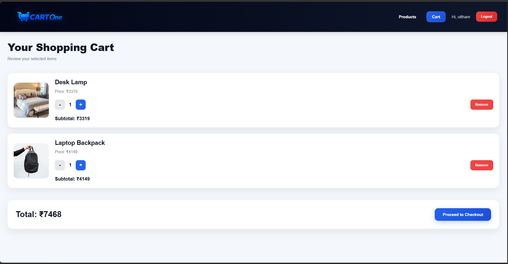
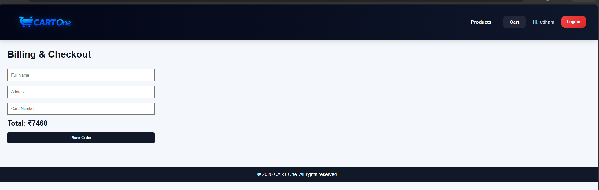
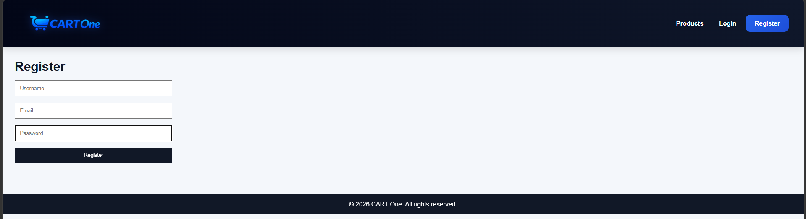
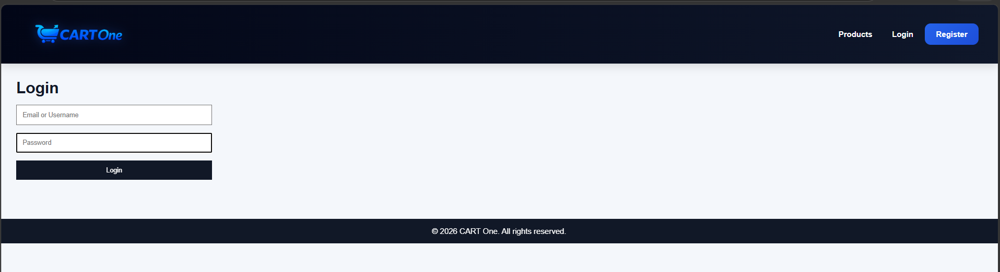

# CART One 🛒

CART One is a modern full-stack ecommerce shopping cart application built using React.js and Node.js.  
The application provides a clean and responsive shopping experience with authentication, cart management, checkout flow, product search, sorting functionality, and professional UI design.

---

# 🚀 Live Features

✅ User Authentication  
✅ JWT Authorization  
✅ Product Listing  
✅ Add to Cart  
✅ Remove from Cart  
✅ Quantity Management  
✅ Checkout Page  
✅ Product Search  
✅ Product Sorting  
✅ Real-time Cart Notification Badge  
✅ Responsive UI  
✅ Professional Error Handling  
✅ Modern Ecommerce Design  

---

# 🛍️ Application Preview

## 🏠 Home Page



### Features
- Product listing
- Product search
- Product sorting
- Responsive product grid
- Modern ecommerce UI

---

## 🛒 Shopping Cart



### Features
- Quantity update
- Remove products
- Dynamic total calculation
- Checkout integration

---

## 💳 Checkout Page



### Features
- Billing form
- Order summary
- Place order functionality

---

## 📝 Register Page



---

## 🔑 Login Page



---

# ✨ Key Highlights

- Full-stack ecommerce workflow
- JWT-based authentication
- Modern React frontend
- REST API integration
- Responsive design
- Professional UI/UX
- Realtime cart updates
- Search and sorting functionality
- Clean component architecture

---

# 🛠️ Tech Stack

## Frontend
- React.js
- React Router DOM
- Axios
- Context API
- CSS Inline Styling

---

## Backend
- Node.js
- Express.js
- JWT Authentication
- bcryptjs

---

# 📁 Project Structure

```bash
cart-one/
│
├── frontend/
├── backend/
├── screenshots/
│
├── README.md
└── .gitignore
```

---

# ⚙️ Installation & Setup

## 1️⃣ Clone Repository

```bash
git clone https://github.com/Uttham-412/cartone-shopping-app.git
```

---

## 2️⃣ Backend Setup

Navigate to backend folder:

```bash
cd backend
```

Install dependencies:

```bash
npm install
```

Start backend server:

```bash
npm run dev
```

Backend runs on:

```bash
http://localhost:5000
```

---

## 3️⃣ Frontend Setup

Navigate to frontend folder:

```bash
cd frontend
```

Install dependencies:

```bash
npm install
```

Run frontend server:

```bash
npm run dev
```

Frontend runs on:

```bash
http://localhost:5173
```

---

# 🔐 Sample Login Credentials

```bash
Email: test@example.com
Password: password123
```

---

# 📦 API Endpoints

## Authentication APIs

| Method | Endpoint | Description |
|--------|----------|-------------|
| POST | /auth/register | Register new user |
| POST | /auth/login | Login user |

---

## Product APIs

| Method | Endpoint | Description |
|--------|----------|-------------|
| GET | /products | Fetch all products |

---

## Cart APIs

| Method | Endpoint | Description |
|--------|----------|-------------|
| GET | /cart | Get user cart |
| POST | /cart/add | Add product to cart |
| PATCH | /cart/update | Update cart quantity |
| DELETE | /cart/remove/:productId | Remove product from cart |

---

# 🎯 Additional Improvements Added

- CART One branding and logo
- Modern ecommerce hero section
- Dynamic cart notification badge
- Active navigation highlighting
- Responsive product cards
- Session expiry handling
- Professional alerts and validations
- Real-time UI updates

---

# 👨‍💻 Author

## Uttham

Built as part of internship assignment submission.

---

# 📌 Note

This project is developed for educational and internship evaluation purposes.